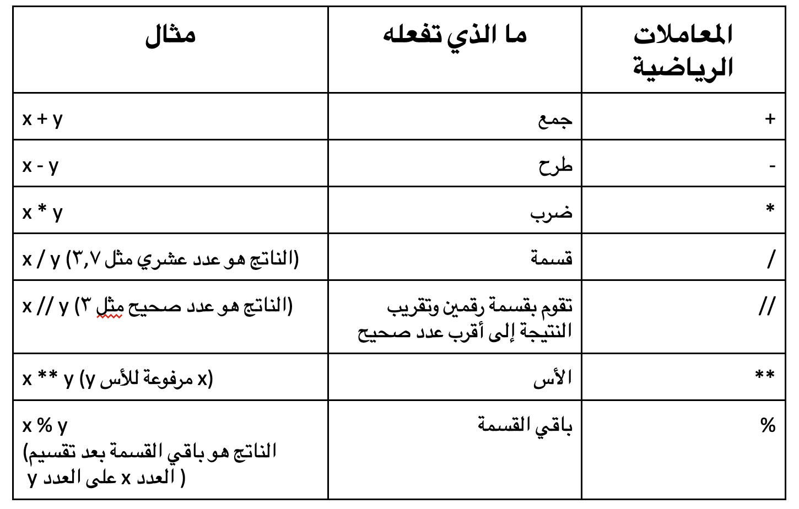
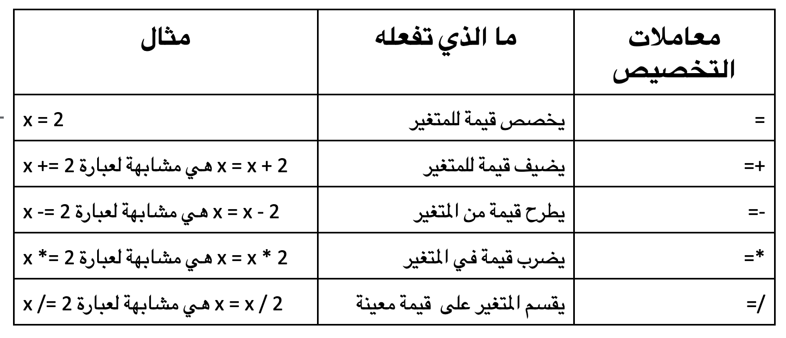

يتم استخدام المعاملات في Python لإجراء عمليات على المتغيرات والقيم.

فيما يلي بعض المعاملات الأساسية التي يمكنك استخدامها في مشاريع Python الخاصة بك:

### المعاملات الحسابية

تؤدي المعاملات الحسابية في Python العمليات الحسابية الشائعة.

### معاملات التخصيص

تُستخدم معاملات التخصيص في Python لتعيين قيم للمتغيرات.

### معاملات المقارنة

تُستخدم عمليات المقارنة في Python لمقارنة قيمتين، ويتم استخدامها بشكل شائع مع العبارات الشرطية أو عبارة `if`.

