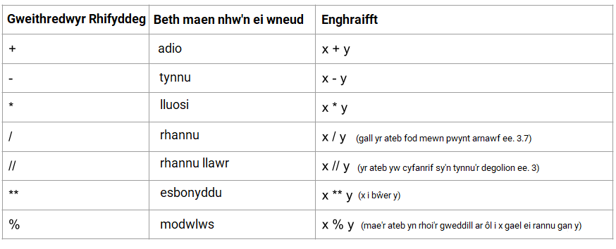
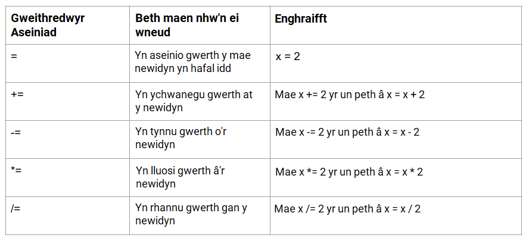

Mae gweithredwyr yn cael eu defnyddio yn Python i gyflawni gweithrediadau ar newidynnau a gwerthoedd.

Dyma rai o'r gweithredwyr sylfaenol gallwch chi eu defnyddio yn eich prosiectau Python:

### Gweithredwyr rhifyddeg

Mae gweithredwyr rhifyddeg Python yn cyflawni gweithrediadau mathemategol cyffredin.

### Gweithredwyr neilltuo

Mae gweithredwyr neilltuo Python yn cael eu defnyddio i neilltuo gwerthoedd i newidynnau.

### Gweithredwyr cymharu

Mae gweithredwyr cymharu Python yn cael eu defnyddio i gymharu dau werth, ac maen nhw'n cael eu defnyddio gyda datganiadau amodol, neu `if`, yn aml.

