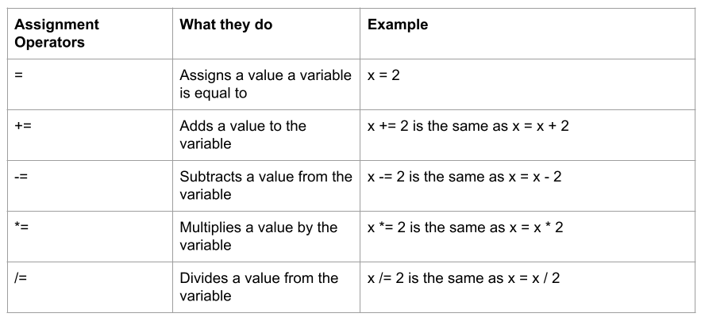

Operators are used in Python to perform operations on variables and values.

Here are some of the basic operators you can use in your Python projects:

### Arithmetic operators

Python's arithmetic operators perform common mathematical operations.

### Assignment operators

Python's assignment operators are used to assign values to variables.

### Comparison operators

Python's comparison operators are used to compare two values, and are commonly used with conditional or `if` statements.

