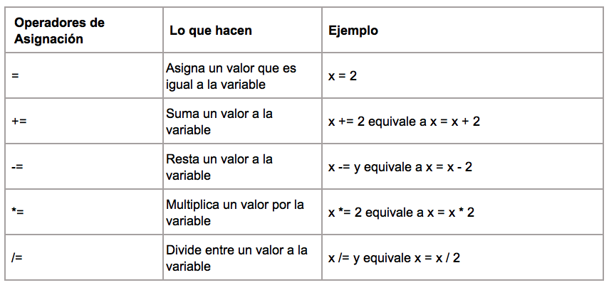

Los operadores se utilizan en Python para realizar operaciones en variables y valores.

Estos son algunos de los operadores básicos que puedes usar en tus proyectos de Python:

### Operadores aritméticos

Los operadores aritméticos de Python realizan operaciones matemáticas comunes.

### Operadores de asignación

Los operadores de asignación de Python se utilizan para asignar valores a las variables.

### Operadores de comparación

Los operadores de comparación de Python se usan para comparar dos valores y se usan comúnmente con sentencias condicionales o con `if`.

