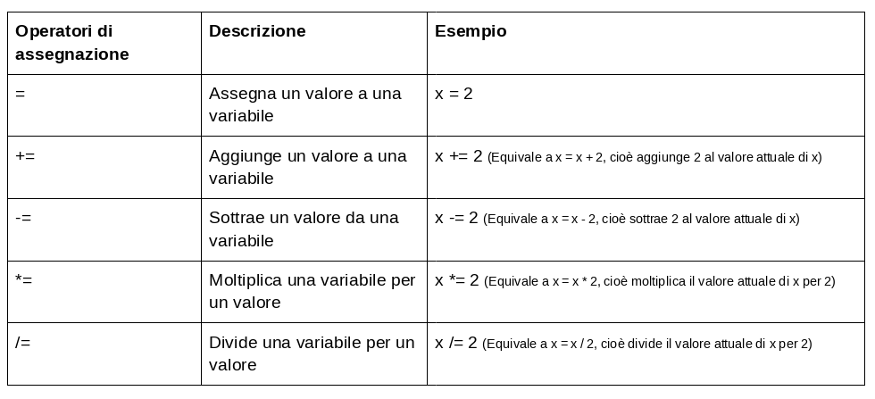

Gli operatori vengono utilizzati in Python per eseguire operazioni su variabili e valori.

Ecco alcuni degli operatori di base che puoi utilizzare nei tuoi progetti Python:

### Operatori aritmetici

Gli operatori aritmetici di Python eseguono operazioni matematiche comuni.

### Operatori di assegnazione

Gli operatori di assegnazione di Python vengono utilizzati per assegnare valori alle variabili.

### Operatori di confronto

Gli operatori di confronto di Python vengono utilizzati per confrontare due valori e sono comunemente usati con istruzioni condizionali o `if`.

