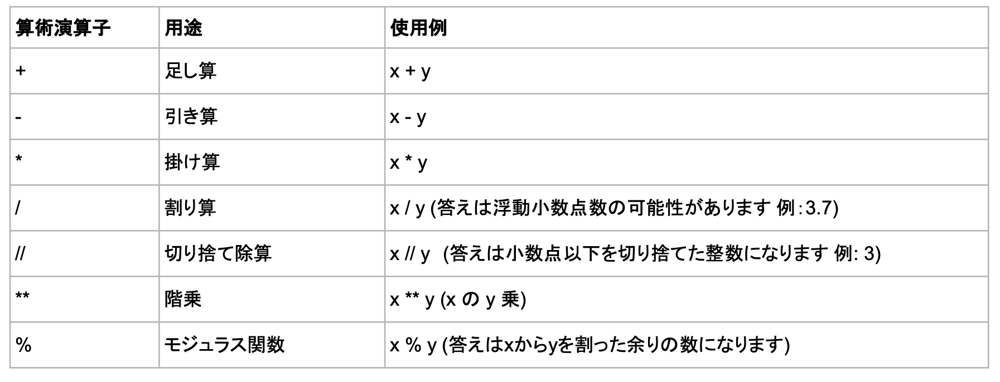
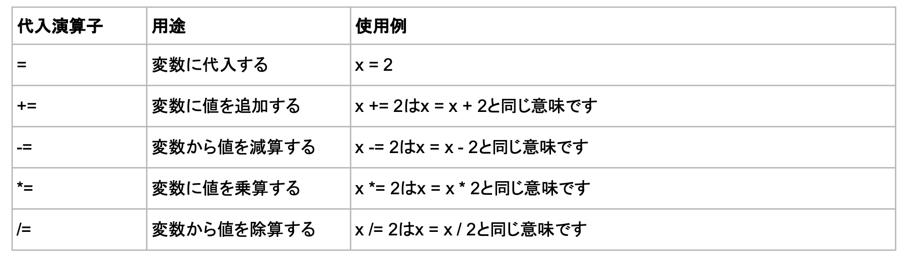
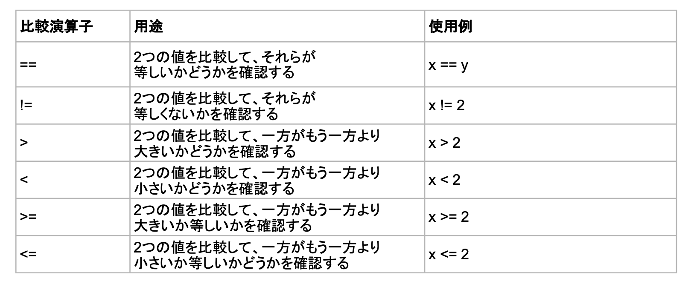

Pythonでは、変数と値の演算を実行するために演算子を使用します。

Pythonプロジェクトで使用できる基本的な演算子のいくつかを次に示します。

### 算術演算子

Pythonの算術演算子は、一般的な数学演算を実行します。

### 代入演算子

Pythonの代入演算子は、変数に値を代入するために使用されます。

### 比較演算子

Pythonの比較演算子は2つの値を比較するために使われ、条件文や`if`文などでよく使われます。

