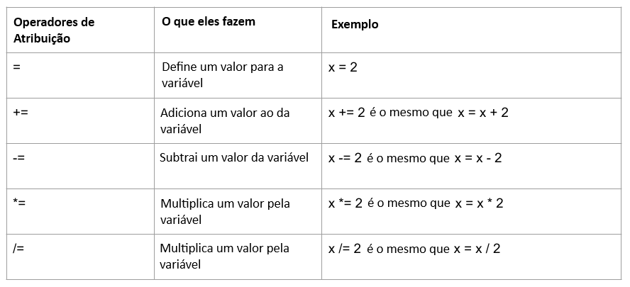

Operadores são usados em Python para realizar operações em variáveis e valores.

Aqui estão alguns dos operadores básicos que você pode usar em seus projetos Python:

### Operadores aritméticos

Os operadores aritméticos do Python executam operações matemáticas comuns.

### Operadores de atribuição

Os operadores de atribuição do Python são usados para atribuir valores a variáveis.

### Operadores de comparação

Os comparadores de operação do Pythonsão utilizados para compatar dois valores. Eles são geralmente usados com intruções condicionais ou `if`.

