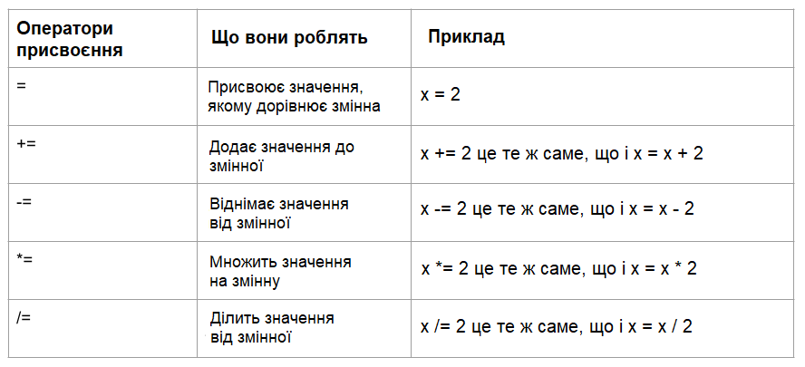

Оператори в Python використовуються для виконання операцій над змінними та значеннями.

Ось деякі з основних операторів, які ти можеш використати у своїх проєктах на Python:

### Арифметичні оператори

Арифметичні оператори Python виконують звичайні математичні операції.

### Оператори присвоєння

Оператори присвоєння Python використовуються для присвоєння значень змінним.

### Оператори порівняння

Оператори порівняння Python використовуються для порівняння двох значень і зазвичай використовуються з умовними операторами або операторами `if`.

